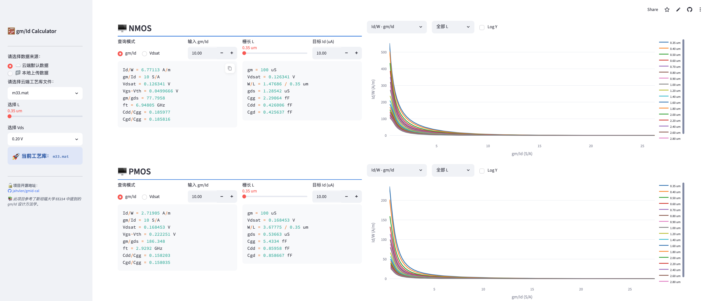

# 🧮 gm/Id Calculator

> 一个基于 gm/Id 方法学的模拟集成电路设计辅助工具，支持工艺参数查表、器件尺寸计算与多维特性曲线可视化。

[](https://www.python.org/)
[](https://streamlit.io/)
[](LICENSE)
[](https://github.com/jahvlen/gmid-cal)

---

## ✨ 功能特性

- **双器件支持**：同时展示 NMOS 与 PMOS 的全套参数，界面并排对比
- **双模式查表**：可按 `gm/Id` 或 `Vdsat` 正向查找所有小信号参数
- **器件尺寸计算**：根据目标 `Id`，自动反推 `W/L`、`gm`、`gds`、`Cgg`、`Cdd`、`Cgd`
- **8 张特性曲线**：`Id/W`、`gm/gds`、`ft`、`Vdsat`、`Cgd/Cgg`、`Cdd/Cgg` 等，可按 L 过滤或自定义组合
- **Log Y 轴切换**：一键对 Y 轴取对数，数据标注仍保留原始物理值
- **云端 / 本地数据**：支持直接从本地加载 `.mat` 工艺库，或在服务端部署时使用内置数据

---

## 📸 界面预览



---

## 🚀 快速开始

### 💡 在线运行
直接访问在线网页版，即开即用：
👉 **[gmid-cal.streamlit.app](https://gmid-cal.streamlit.app)**

### 💻 本地部署
如果需要本地运行，安装依赖后执行：
```bash
pip install -r requirements.txt
streamlit run gmid_cal.py
```

---

## 📁 数据格式说明

本工具读取 MATLAB `.mat` 格式的工艺仿真数据文件，文件内须包含以下变量：

### 自变量（1D 数组）

| 变量名 | 含义         | 单位 |
|--------|------------|------|
| `L`    | 栅长扫描列表   | m    |
| `VDS`  | 漏源电压扫描列表 | V    |
| `VGS`  | 栅源电压扫描列表 | V    |

### 器件参数矩阵（2D 数组，行 = VGS 扫描，列 = L 扫描）

每类器件（`N_` = NMOS，`P_` = PMOS）须包含以下 8 个参数矩阵（共 16 个）：

| 变量名（以 `N_` 为例）    | 含义          | 单位   |
|--------------------------|-------------|------|
| `N_gm_Id`                | gm/Id       | S/A  |
| `N_Id_W`                 | Id/W        | A/m  |
| `N_Vdsat`                | Vdsat       | V    |
| `N_Vgs_Vth`              | Vgs - Vth   | V    |
| `N_gm_gds`               | gm/gds      | —    |
| `N_ft`                   | ft          | Hz   |
| `N_Cdd_Cgg`              | Cdd/Cgg     | —    |
| `N_Cgd_Cgg`              | Cgd/Cgg     | —    |

> 注意：`ft` 在文件中以 **Hz** 存储，工具内自动换算为 **GHz** 显示。PMOS 将上述前缀替换为 `P_` 即可。

---

## 🗂️ 项目结构

```
gmid-cal/
├── gmid_cal.py          # 主应用脚本
├── requirements.txt     # Python 依赖
├── *.mat                # 工艺数据文件（不含于仓库，请自行准备）
└── README.md
```

---

## 🛠️ 技术栈

| 组件       | 版本     | 用途           |
|----------|--------|--------------|
| Python   | 3.10+  | 运行环境         |
| Streamlit| 1.58   | Web UI 框架    |
| NumPy    | 2.5    | 数值计算与插值      |
| SciPy    | 1.18   | 加载 .mat 文件   |
| Plotly   | 6.8    | 交互式特性曲线绘图    |

---

## 📚 方法学参考

本项目基于斯坦福大学 **EE214** 课程中由 **Boris Murmann（穆尔曼）教授** 提出并推广的 **gm/Id 设计方法学**。

该方法以 gm/Id 为核心设计变量，将模拟电路设计从依赖人工经验的"平方律"时代，引向了一套可量化、可自动化的查表工作流，极大地提升了短沟道工艺下的设计效率与精度。

相关资料：
- [B. Murmann, "EE214 Lecture Notes"](https://web.stanford.edu/class/ee214/)
- P. Jespers & B. Murmann, *Systematic Design of Analog CMOS Circuits*, Cambridge University Press, 2017.

---

## 🤝 贡献指南

欢迎提交 Issue 或 Pull Request！

1. Fork 本仓库
2. 新建分支：`git checkout -b feature/your-feature`
3. 提交更改：`git commit -m 'feat: add some feature'`
4. 推送分支：`git push origin feature/your-feature`
5. 发起 Pull Request

---

## 📄 License

本项目以 [MIT License](LICENSE) 开源，欢迎自由使用与改造，保留原始作者署名即可。

---

<div align="center">
  <sub>Made with ❤️ for analog IC designers ·
  <a href="https://github.com/jahvlen/gmid-cal">jahvlen/gmid-cal</a>
  </sub>
</div>
