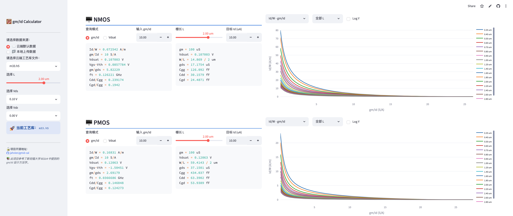

# 🧮 gm/Id Calculator

> 一个基于 gm/Id 方法学的模拟集成电路设计辅助工具，支持工艺参数查表、器件尺寸计算与多维特性曲线可视化。

[](https://www.python.org/)
[](https://streamlit.io/)
[](LICENSE)
[](https://github.com/jahvlen/gmid-cal)

---

## ✨ 功能特性

- **双器件支持**：同时展示 NMOS 与 PMOS 的全套参数，界面并排对比。
- **四维嵌套扫描支持**：严格遵循最新版 4D 参数扫描规范（$V_{GS} \rightarrow L \rightarrow V_{DS} \rightarrow V_{SB}$），全面支持衬底偏置（体效应）。
- **双模式查表**：可按 `gm/Id` 或 `Vdsat` 正向查找所有小信号参数。
- **器件尺寸计算**：根据目标 `Id`，自动反推 `W/L`、`gm`、`gds`、`Cgg`、`Cdd`、`Cgd`。
- **8 张特性曲线**：`Id/W`、`gm/gds` 、`ft`、`Vdsat`、`Cgd/Cgg`、`Cdd/Cgg` 等，支持按 L 过滤、亚阈值区单调清洗与自定义组合。
- **开源 HDF5 数据库**：放弃了商业闭源的 MATLAB `.mat` 格式，全链路原生支持国际开源标准的 **HDF5 (`.h5`)**，加载极速，省内存，支持惰性切片。
- **云端 / 本地数据**：支持直接从本地上传 `.h5` 工艺库，或在服务端部署时使用内置数据。

---

## 📸 界面预览



---

## 🚀 快速开始

### 💡 在线运行
直接访问在线网页版，即开即用：
👉 **[gmid-cal.streamlit.app](https://gmid-cal.streamlit.app)**

### 💻 本地部署
如果需要本地运行，安装依赖后执行：
```bash
pip install -r requirements.txt
streamlit run gmid_cal.py
```

---

## 📁 数据格式说明

本工具读取开源 HDF5 (`.h5`) 格式的工艺仿真数据文件。一个完整的 4D 数据库文件中需包含以下两部分数据：

### 1. 自变量网格（1D 数组）

| 变量名 | 含义         | 单位 |
|--------|------------|------|
| `L`    | 栅长扫描列表   | m    |
| `VDS`  | 漏源电压扫描列表 | V    |
| `VGS`  | 栅源电压扫描列表 | V    |
| `VSB`  | 衬底偏置电压列表 | V    |

---

### 2. 原始参数矩阵（共 40 个，每个器件 20 个）

通过 [run.ocn] 仿真脚本直接导出的 20 个 4D 参数矩阵（大小为 `(VGS_len, VDS_len, L_len, VSB_len)`，NMOS 前缀为 `N_`，PMOS 前缀为 `P_`）：

| 变量名（以 NMOS 为例） | 含义 | 说明 |
| :--- | :--- | :--- |
| `N_id` | 漏极电流 ($I_D$) | 从 DC 结果读取 |
| `N_igd` | 栅漏漏电流 ($I_{gd}$) | 从 DC 结果读取 |
| `N_igs` | 栅源漏电流 ($I_{gs}$) | 从 DC 结果读取 |
| `N_vth` | 阈值电压 ($V_{th}$) | 从 DC 结果读取 |
| `N_gm` | 跨导 ($g_m$) | 从 DC 结果读取 |
| `N_gmb` | 体跨导 ($g_{mb}$) | 从 DC 结果读取 |
| `N_gds` | 输出电导 ($g_{ds}$) | 从 DC 结果读取 |
| `N_cgg` | 栅极总电容 ($C_{gg}$) | 从 DC 结果读取 |
| `N_cgd` | 栅漏电容 ($-C_{gd}$) | 导出时自动取负为正值 |
| `N_cgs` | 栅源电容 ($-C_{gs}$) | 导出时自动取负为正值 |
| `N_cgb` | 栅衬电容 ($-C_{gb}$) | 导出时自动取负为正值 |
| `N_cdd` | 漏极总电容 ($C_{dd}$) | 从 DC 结果读取 |
| `N_cdg` | 漏栅电容 ($-C_{dg}$) | 导出时自动取负为正值 |
| `N_css` | 源极总电容 ($C_{ss}$) | 从 DC 结果读取 |
| `N_csg` | 源栅电容 ($-C_{sg}$) | 导出时自动取负为正值 |
| `N_cjd` | 漏结电容 ($C_{jd}$) | 从 DC 结果读取 |
| `N_cjs` | 源结电容 ($C_{js}$) | 从 DC 结果读取 |
| `N_vdsat` | 饱和电压 ($V_{dsat}$) | 从 DC 结果读取 |
| `N_id_n` | 漏极通道噪声电流密度 | 从 Noise 结果读取 |
| `N_fn_n` | 闪烁噪声系数 (Flicker) | 从 Noise 结果读取 |

---

### 3. 自动计算的派生参数（共 16 个，每个器件 8 个）

数据转换脚本 [aRead.py]会根据上面的原始数据，自动在 Python 侧计算并写入以下 8 个专门用于网页可视化的派生 4D 数据集：

| 变量名（以 NMOS 为例） | 对应公式 | 含义 |
| :--- | :--- | :--- |
| `N_gm_Id` | $g_m / \vert I_D \vert$ | 跨导效率 (S/A) |
| `N_Id_W` | $\vert I_D \vert / W$ | 单位宽度电流密度 (A/m) |
| `N_Vdsat` | $\vert V_{dsat} \vert$ | 饱和电压绝对值 (V) |
| `N_Vgs_Vth` | $V_{GS} - V_{th}$ (P管相反) | 过载电压 (V) |
| `N_gm_gds` | $g_m / g_{ds}$ | 本征增益 (Intrinsic Gain) |
| `N_ft` | $g_m / (2\pi \cdot C_{gg})$ | 特征频率 (Hz，工具内换算为 GHz) |
| `N_Cdd_Cgg` | $C_{dd} / C_{gg}$ | 漏极栅极电容比值 |
| `N_Cgd_Cgg` | $\vert C_{gd} \vert / C_{gg}$ | 反向传输栅极电容比值 |

---


## 📚 方法学参考

本项目基于斯坦福大学 **EE214** 课程中由 **Boris Murmann（穆尔曼）教授** 提出并推广的 **gm/Id 设计方法学**。

相关资料：
- [B. Murmann, "EE214 Lecture Notes"](https://web.stanford.edu/class/ee214/)
- P. Jespers & B. Murmann, *Systematic Design of Analog CMOS Circuits*, Cambridge University Press, 2017.

---

## 🤝 贡献

欢迎提交 Issue 或 Pull Request！

---

## 📄 License

本项目以 [MIT License](LICENSE) 开源，欢迎自由使用与改造，保留原始作者署名即可。

---

<div align="center">
  <sub>Made with ❤️ for analog IC designers ·
  <a href="https://github.com/jahvlen/gmid-cal">jahvlen/gmid-cal</a>
  </sub>
</div>
